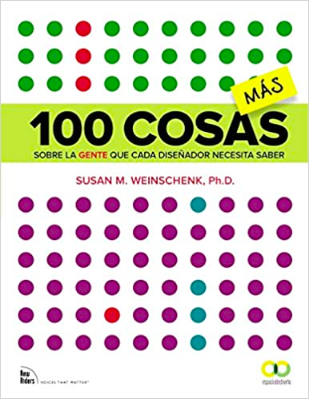

# ✔️ Procesos de trabajo

## Tener acceso a más herramientas que te puedan ayudar en el trabajo.

Un vistazo de vez en cuando a product hunt te mantendrá al dia de que plataformas, herramientas y servicios van surgiendo. Así descubrí con lo que estamos escribiendo este proyecto.



**De todos modos creo que las herramientas es la parte fácil.** Dominar una y ser muy solvente con ella. Da igual Figma, Sketch, Adobe xd o Penpot (esta incluso mejor que código abierto) es todo lo demás lo que te hará destacar. Estamos en un tiempo en que el conocimiento técnico empieza a ser una _commodity_.

## Psicología del diseño

Todo el tiempo que invirtais en estudiar esta rama os vendrá genial en vuestra carrera profesional.

* Puedes empezar leyendo a Kahneman "Pensar rápido, pensar despacio" y después "ruido". No son fáciles. También Dan Ariely, Kapolsky o cualquier otro científico/a que os transmita conocimiento y os llegue.
* La parte de sesgos enfocados a diseño.

Podeis seguir también a Ramón Nogueras que tiene un libro muy interesante y está continuamente divulgando sobre el tema.



Específicamente para diseñadores/as creo que esta serie de libros es imprescindible.

<figure><figcaption></figcaption></figure>

Mejor acotar qué áreas. Cada una tiene sus procesos. Si te interesa la parte de Design Thinking tienes que conocer los que empezaron con ello. Los procesos de IDEO, además tienen cursos en abierto.



En la parte de interacción




Nuevo proyecto de la genial Carmel Hassan


Y por supuesto la fantástica página



La parte de servicios



### Es importante conocer la jerga

Más información sobre tecnicismos del sector.

Si algo no sobra es información, si algo nos falta es la capacidad de filtrar los contenidos. Por eso pide recomendaciones de libros, videos, eventos, profesionales… a gente en cuyo criterio confíes.

Si te interesa la parte web



Si te interesa el visual, sigue a las grandes Paula Scher, etc Si te interesa lo audiovisual una cuenta en filmin y así sucesivamente. De todos modos también es importante que te crees tus propios referentes. Yo no tengo problema en compartir los mios. En Diseño Kenya Hara y Aaron Draplin, profesionalmente muy distintos, son de los que más me han influenciado junto con la forma de pensar de Paula. Pero no tendría mucho sentido que sigas los mismos pasos, abosorbe todo lo que pudas y create tu propio universo de referencias y fuentes de las que beber.

Si hay 3 campos que creo que todo diseñador/a debe conocer. Por un lado la propia profesión y disciplina del diseño. Por otro toda la parte de negocio y ahí estar al día de como funciona el sector de la inversión, empresas y startups es importante. Una base de economía ayuda mucho y puede ser algo tan accesible como los libros del "economista camuflado" o "freakonomics". Por último es muy importante conocer la tecnología en que vas a trabajar. Si los clásicos sabían de pigmentos y soportes… nosotros tenemos que conocer los dispositivos, los navegadores y tener un lenguaje común con los compañeros con los que vamos a trabajar.

Si es digital: metodología como Scrum, Agile, lenguajes, sistemas de doumentación, etc.

Puedes empezar por:



Y por supuesto el canal de nuestra admirada [Cristina Santamarina](https://www.linkedin.com/in/cristinasantamarina/)



## Saber lo que necesitan las personas te hará un/a profesional muy valioso/a

Otra gran aproximación. Si piensas así serás un buen diseñador/a.

Recomiendo este curso. Yo lo hice, te ayuda a pensar de ese modo y es gratuito.



Después usar la curiosidad, observar hablar con personas de distintos puntos de vista y aprender todo lo que puedas de Research. Es una profesión específica pero también un área que todo profesional debe conocer.

Estos libros son los que yo empecé

<figure><figcaption></figcaption></figure>

<figure><figcaption></figcaption></figure>
